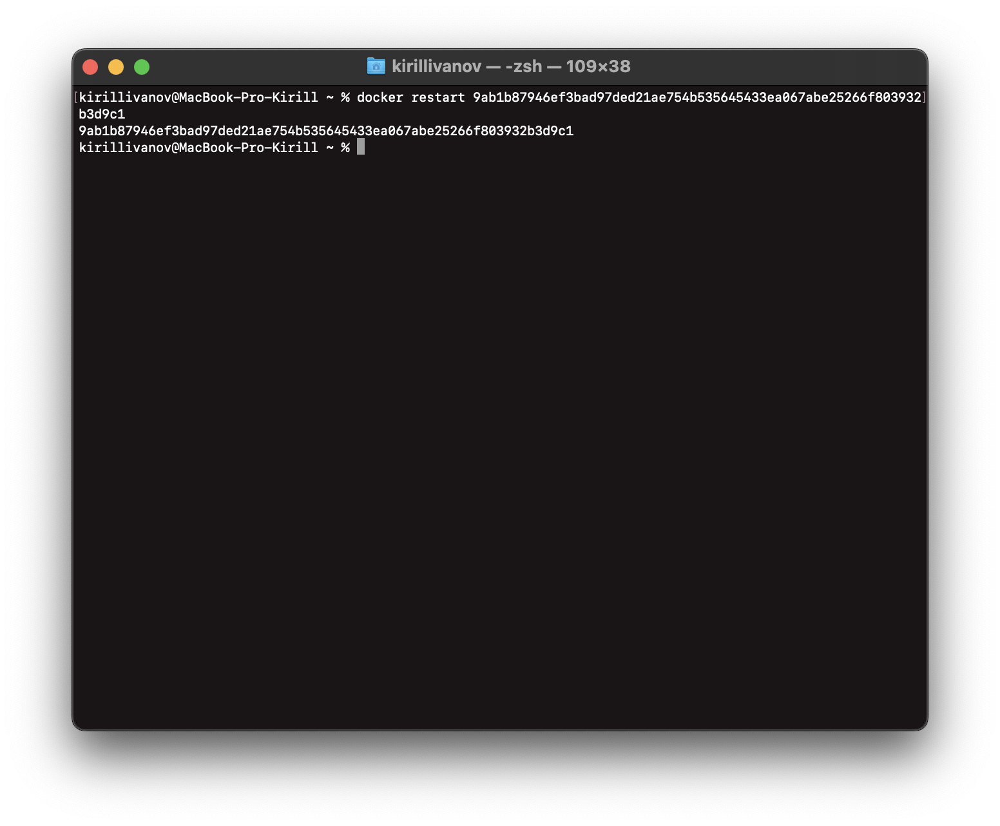
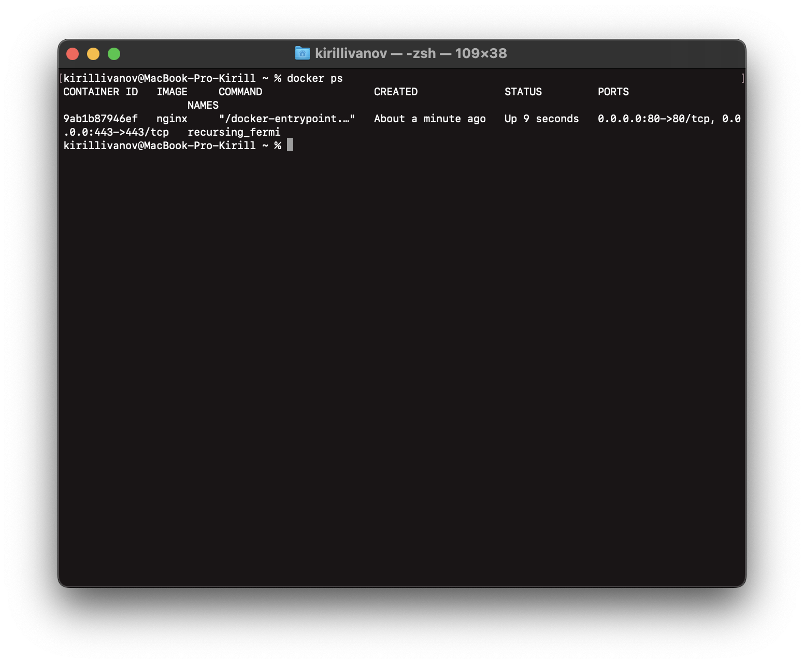

## Part 1. Готовый докер  
##### Взял официальный докер образ с **nginx** и выкачал его при помощи `docker pull nginx`  
  
##### Проверил наличие докер образа через `docker images`  

##### Запустил докер образ через `docker run -d [image_id|repository]`  
  
##### Проверить, что образ запустился через `docker ps`  
  
##### Посмотреть информацию о контейнере через `docker inspect [container_id|container_name]`  
  
##### По выводу команды определить и поместить в отчёт размер контейнера, список замапленных портов и ip контейнера  
  
  
##### Остановить докер образ через `docker stop [container_id|container_name]`  
  
##### Проверить, что образ остановился через `docker ps`  
    
##### Запустить докер с портами 80 и 443 в контейнере, замапленными на такие же порты на локальной машине, через команду *run*
    
 
##### Проверить, что в браузере по адресу *localhost:80* доступна стартовая страница **nginx** 

##### Перезапустить докер контейнер через `docker restart [container_id|container_name]`  
  
##### Проверить любым способом, что контейнер запустился  
    

## Part 2. Операции с контейнером  

##### Прочитал конфигурационный файл *nginx.conf* внутри докер контейнера через команду *exec*  

##### Создал на локальной машине файл *nginx.conf*  
##### Настроил в нем по пути */status* отдачу страницы статуса сервера **nginx**  
 
##### Скопировал созданный файл *nginx.conf* внутрь докер образа через команду `docker cp`  
 
##### Перезапустил **nginx** внутри докер образа через команду *exec*  

##### Проверил, что по адресу *localhost:80/status* отдается страничка со статусом сервера **nginx**  
  

##### Экспортировал контейнер в файл *container.tar* через команду *export*  

##### Остановил контейнер  

##### Удалил образ через `docker rmi [image_id|repository]`, не удаляя перед этим контейнеры  

##### Удалил остановленный контейнер  
 

##### Импортировал контейнер обратно через команду *import*  
 
##### Запустил импортированный контейнер  

##### Проверил, что по адресу *localhost:80/status* отдается страничка со статусом сервера **nginx**  

